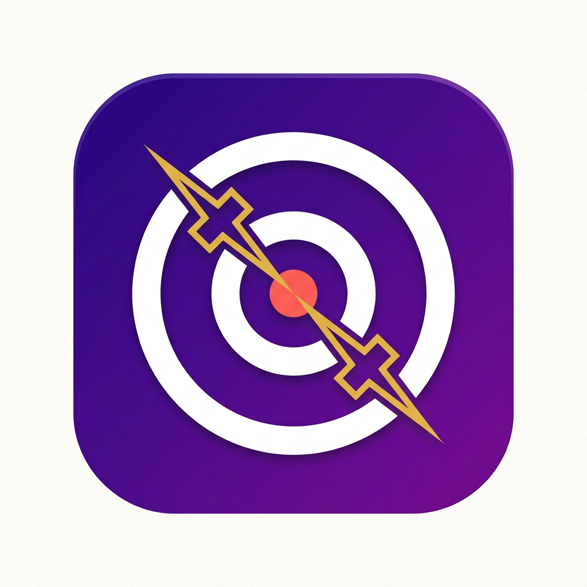
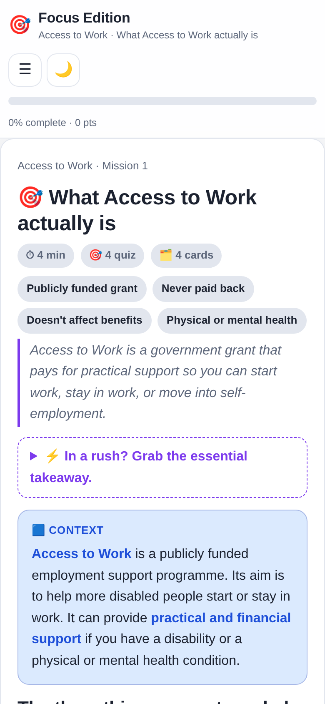

# 🎯 Focus Edition — finish the documents you've been avoiding

Focus Edition turns long, boring documents into short, completable **missions** for ADHD brains: a time estimate up front, a clear ending, a quick quiz, flashcards, and progress that saves automatically.

- **Live demo (Access to Work Edition):** https://access-to-work-edition.netlify.app/
- **Landing page:** https://focus-edition.netlify.app/



## The demo

The DWP Access to Work factsheet — the dense, official kind nobody reads for fun — re-cut into **13 missions**. Open it and try one: about a minute to feel the difference.



## Tech

Deliberately boring tech: **one HTML file, zero dependencies, zero backend, zero build step.** It works offline, on any device, with no account and no app store.

```bash
# run it locally
python3 -m http.server 8000
# open http://localhost:8000
```

Or just double-click `index.html`.

## Roadmap

- [x] Access to Work demo edition (13 missions)
- [x] Landing page + email list
- [ ] New editions (suggest a document: aa_fitness@outlook.com)
- [ ] PWA packaging (installable, offline-first)
- [ ] Edition-builder engine (convert documents faster)
- [ ] Completion analytics
- [ ] Native app wrapper

## Contribute / co-found

Looking for a **technical co-founder** (web/mobile) to turn this prototype into an engine + app — equity with vesting. If that interests you, email aa_fitness@outlook.com with something you've shipped.

Bug reports and pull requests welcome. Please keep the zero-dependency, single-file spirit unless there's a strong reason.

## Licences

- **Code:** MIT — see [LICENSE](LICENSE).
- **Access to Work content:** © Crown copyright, reused under the [Open Government Licence v3.0](https://www.nationalarchives.gov.uk/doc/open-government-licence/version/3/). This is an unofficial adaptation; check GOV.UK for the authoritative text.
